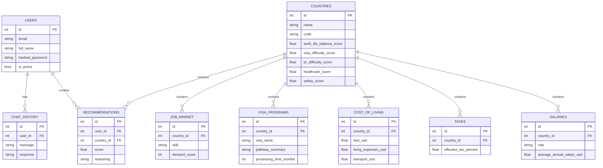

# ER Diagram

```mermaid
erDiagram
  USERS ||--o{ RECOMMENDATIONS : creates
  USERS ||--o{ CHAT_HISTORY : has
  COUNTRIES ||--o{ SALARIES : contains
  COUNTRIES ||--o{ TAXES : contains
  COUNTRIES ||--o{ COST_OF_LIVING : contains
  COUNTRIES ||--o{ VISA_PROGRAMS : contains
  COUNTRIES ||--o{ JOB_MARKET : contains
  COUNTRIES ||--o{ RECOMMENDATIONS : receives

  USERS {
    int id PK
    string email
    string full_name
    string hashed_password
    bool is_active
  }

  COUNTRIES {
    int id PK
    string name
    string code
    float work_life_balance_score
    float visa_difficulty_score
    float pr_difficulty_score
    float healthcare_score
    float safety_score
  }

  SALARIES {
    int id PK
    int country_id FK
    string role
    float average_annual_salary_usd
  }

  TAXES {
    int id PK
    int country_id FK
    float effective_tax_percent
  }

  COST_OF_LIVING {
    int id PK
    int country_id FK
    float rent_usd
    float living_expenses_usd
    float transport_usd
  }

  VISA_PROGRAMS {
    int id PK
    int country_id FK
    string visa_name
    string pathway_summary
    int processing_time_months
  }

  JOB_MARKET {
    int id PK
    int country_id FK
    string skill
    int demand_score
  }

  RECOMMENDATIONS {
    int id PK
    int user_id FK
    int country_id FK
    float score
    string reasoning
  }

  CHAT_HISTORY {
    int id PK
    int user_id FK
    string message
    string response
  }
```
